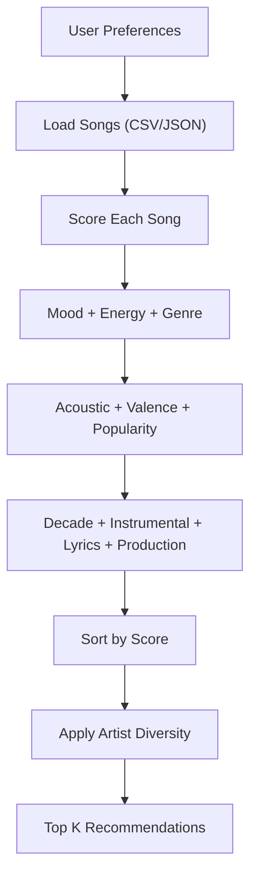
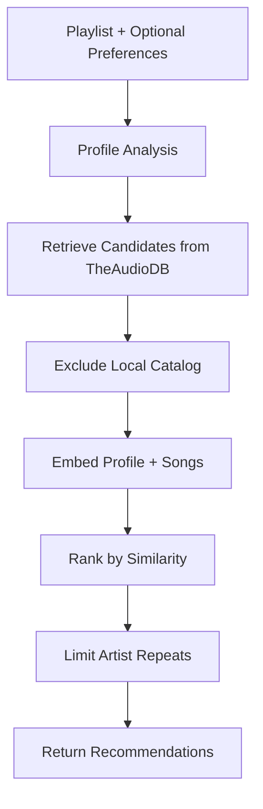

# 🎵 Music Recommender Simulation

## Project Summary

VibeFinder is a small, explainable music recommender with two paths:

- A deterministic scoring engine that ranks a 20-song catalog using mood, energy, genre, and additional audio features.
- A RAG-powered discovery flow that pulls new songs from TheAudioDB and ranks them with semantic similarity.

The project includes a Python CLI, a Flask API for discovery, and a React UI that visualizes recommendations, the full catalog, and a saved playlist.

---

## How The System Works

VibeFinder uses a content-based approach. The core idea is to turn user preferences into a numeric score for every song, then return the top results. A separate RAG pipeline broadens discovery by using external data and text similarity.

### Recommendation Flow (Scoring Engine)



### Discovery Flow (RAG Agent)



---

## Features

- Content-based scoring with explainable point breakdowns.
- Two scoring modes: `mood_priority` and `genre_priority`.
- RAG discovery via TheAudioDB plus sentence-transformers embeddings.
- Artist diversity filtering so one artist does not dominate top results.
- React UI with tabs for Recommend, Catalog, and Playlist.
- Playlist persistence to `data/playlist.json` via a Flask API.

---

## Repository Structure

```
applied-ai-project/
├── data/
│   ├── songs.csv                     # Primary 20-song catalog (Python)
│   └── playlist.json                 # Saved playlist (API/Frontend)
├── frontend/                         # React + Vite UI
│   ├── src/
│   │   ├── engine/                   # JS recommender + discovery client
│   │   ├── views/                    # Recommend/Catalog/Playlist/Discover screens
│   │   └── data/songs.json           # Catalog copy for the UI
│   └── package.json
├── src/
│   ├── main.py                       # CLI entry (demo, agentic, rag)
│   ├── recommender.py                # Scoring engine + ranking
│   ├── rag_agent.py                  # RAG pipeline (AudioDB + embeddings)
│   ├── audiodb_client.py             # AudioDB HTTP client
│   └── api.py                        # Flask API for discovery + playlist
├── tests/                            # Pytest coverage for core logic
├── model_card.md
├── reflection.md
├── requirements.txt
└── README.md
```

---

## Backend (Python)

### Scoring Engine

The scoring engine in [src/recommender.py](src/recommender.py) converts user preferences and song features into a weighted score. It includes:

- Mood match + similarity groups
- Energy proximity bands
- Genre match + related genres
- Acousticness, valence, popularity, decade
- Instrumentalness, lyrical sentiment, production complexity
- Artist diversity (one per artist, then backfill)

The CLI defaults to `genre_priority` in [src/main.py](src/main.py#L33).

### RAG Agent

The RAG pipeline in [src/rag_agent.py](src/rag_agent.py):

- Derives a taste profile from [data/playlist.json](data/playlist.json) or an uploaded playlist.
- Retrieves candidates via TheAudioDB, then filters out local catalog songs.
- Encodes text with `sentence-transformers/all-MiniLM-L6-v2`.
- Ranks by semantic similarity and applies artist diversity.
- Optionally boosts results for explicit user preferences.

If you have a Hugging Face token, you can set `HF_TOKEN` to speed up model downloads.

---

## Frontend (React + Vite)

The React app mirrors the Python scorer for local recommendations and connects to the Flask API for discovery.

- Recommend tab runs the JS scoring engine in [frontend/src/engine/recommender.js](frontend/src/engine/recommender.js).
- Discover tab calls the backend `POST /api/discover` in [frontend/src/engine/discover.js](frontend/src/engine/discover.js).
- Catalog tab filters and sorts the 20-song catalog.
- Playlist tab persists saved songs via the API.

Vite proxies `/api` to `http://127.0.0.1:5000` for local development.

---

## Getting Started

### Python Setup

```bash
python -m venv .venv
.venv\Scripts\activate
pip install -r requirements.txt
```

### Run The CLI Demo

```bash
python -m src.main
```

### Run The RAG Agent (CLI)

```bash
python -m src.main --mode rag --query "something chill for studying"
```

### Start The Flask API

```bash
python -m src.api
```

### Start The Frontend

```bash
cd frontend
npm install
npm run dev
```

Open the printed Vite URL in your browser. The Discover tab requires the API running on port 5000.

---

## Tests

```bash
pytest
```

---

## Data Notes

- The Python catalog lives in [data/songs.csv](data/songs.csv).
- The React UI reads [frontend/src/data/songs.json](frontend/src/data/songs.json).
- The playlist file is stored at [data/playlist.json](data/playlist.json) and updated via the API.
- AudioDB results are normalized into the same schema before ranking.

---

## Agentic Workflow (Compose Style)

Use a single JSON workflow file to run the Plan -> Execute -> Observe -> Re-plan controller.

```bash
python -m src.main --mode agentic --workflow-file planning/local-workflow/workflow-compose.json
```

Override defaults when needed:

```bash
python -m src.main --mode agentic --workflow-file planning/local-workflow/workflow-compose.json --retry-budget 2
```

---

## External Agent Packet

Generate a single prompt packet for external agents (Claude Code, etc.):

```bash
python planning/external-agent/build_packet.py
```

Optional PowerShell helper:

```powershell
powershell -File planning/external-agent/run_packet.ps1
```

The packet is written to [planning/external-agent/packet.generated.md](planning/external-agent/packet.generated.md).

---

## Reflection

- [model_card.md](model_card.md)
- [reflection.md](reflection.md)

---

## Demo Video

[Watch on Loom](https://www.loom.com/share/3b40892e890d4e6cadc9714284358ad9)
