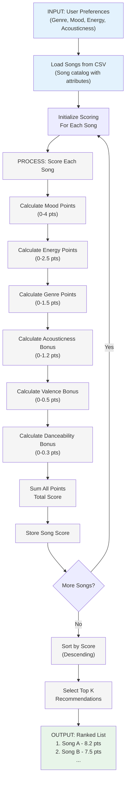
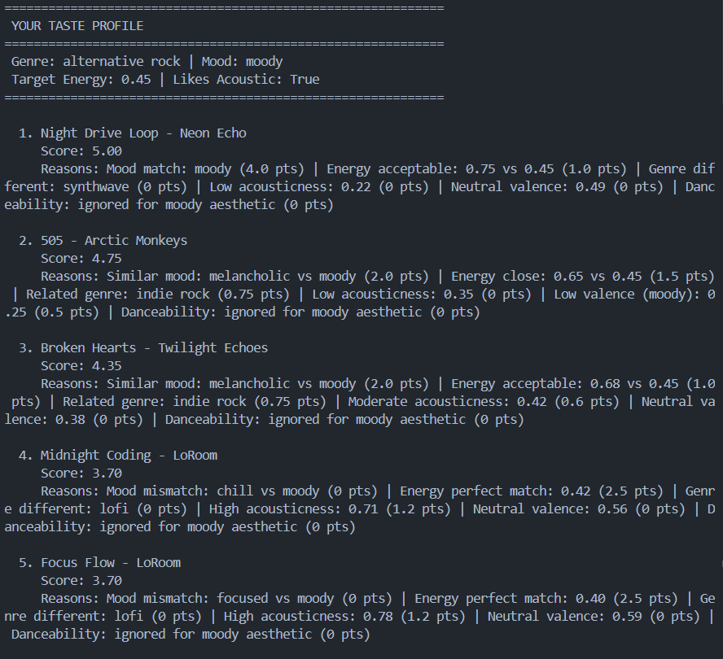
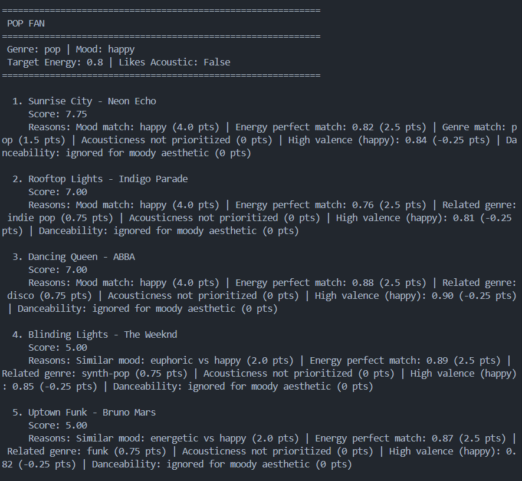
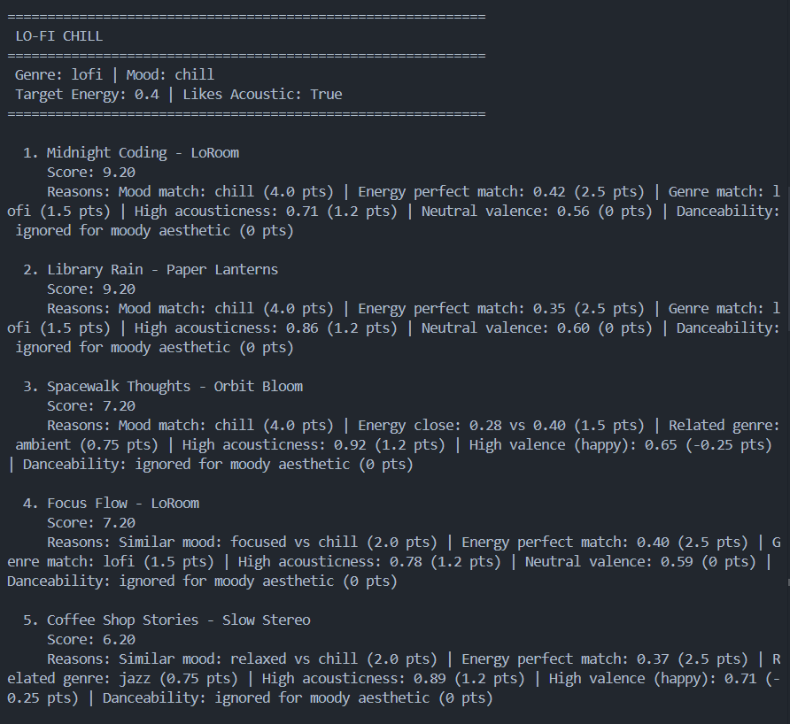
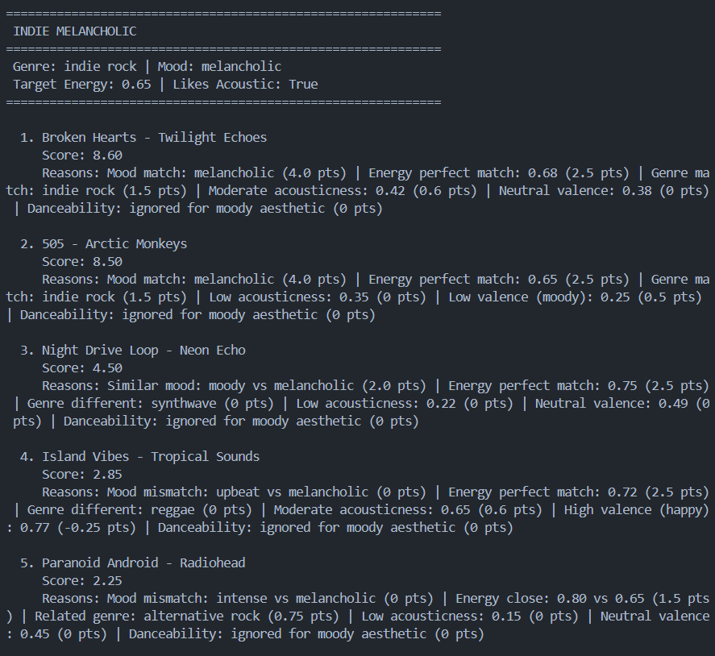
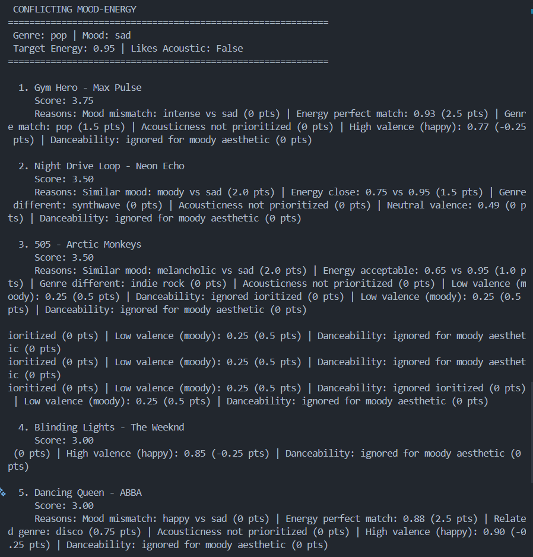

# 🎵 Music Recommender Simulation

## Project Summary

In this project you will build and explain a small music recommender system.

Your goal is to:

- Represent songs and a user "taste profile" as data
- Design a scoring rule that turns that data into recommendations
- Evaluate what your system gets right and wrong
- Reflect on how this mirrors real world AI recommenders

Replace this paragraph with your own summary of what your version does.

---

## How The System Works

In the real world, music apps use other users' data or the user's own data or both to determine what songs the user is most likely to be wanting to listen to next. For example, in the collaborative approach (using other users' data), a user who likes The Weeknd will be recommended artists whom other The Weeknd lovers listen to. On the other hand, regarding the content-based approach (using that user's data), songs will be recommended based on how frequently the user listens to that genre, how much they like certain moods, energy levels, etc.

### Data Flow Diagram



### Design Overview

- My system uses a content-based approach, prioritizing genre, mood, and energy.
- The `UserProfile` stores user preferences: favorite genre, favorite mood, target energy level, and whether they like acoustic sounds.
- The `Recommender` computes a weighted score for each song using a point-based system:
  - Mood matching (0-4 pts) - Highest weight for mood-centric recommendations
  - Energy proximity (0-2.5 pts) - How close to target energy
  - Genre matching (0-1.5 pts) - Genre compatibility
  - Acousticness (0-1.2 pts) - Bonus for acoustic elements
  - Valence alignment (0-0.5 pts) - Emotional tone
  - Danceability (0-0.3 pts) - Minimal weight for moody preferences
- Top K songs are selected based on total point score.

### Algorithm Recipe

**For a user with mood-centric preferences:**

```
FOR each song in catalog:
  score = 0

  IF song.mood == user.favorite_mood:
    score += 4 points
  ELSE IF song.mood similar to favorite_mood:
    score += 2 points

  energy_diff = ABS(song.energy - user.target_energy)
  IF energy_diff <= 0.1:
    score += 2.5 points
  ELSE IF energy_diff <= 0.2:
    score += 1.5 points
  ELSE IF energy_diff <= 0.3:
    score += 1.0 point

  IF song.genre == user.favorite_genre:
    score += 1.5 points
  ELSE IF song.genre related to favorite_genre:
    score += 0.75 points

  IF song.acousticness > 0.7:
    score += 1.2 points
  ELSE IF song.acousticness > 0.4:
    score += 0.6 points

  IF song.valence < 0.3:
    score += 0.5 points  (lower valence = moodier)
  ELSE IF song.valence > 0.6:
    score -= 0.25 points (high valence ≠ moody)

  ignore danceability (minimal 0.3 pts)

  songs_with_scores.append((song, score))

RETURN top_k(songs_with_scores, k=5)
```

**Total Possible Points:** 10 points (perfect recommendation)

---

## Getting Started

### Setup

1. Create a virtual environment (optional but recommended):

   ```bash
   python -m venv .venv
   source .venv/bin/activate      # Mac or Linux
   .venv\Scripts\activate         # Windows

   ```

2. Install dependencies

```bash
pip install -r requirements.txt
```

3. Run the app:

```bash
python -m src.main
```

### Running Tests

Run the starter tests with:

```bash
pytest
```

You can add more tests in `tests/test_recommender.py`.

---

## Test Profiles

### Standard Profiles

**Your Taste Profile**  


| Genre            | Mood  | Energy | Acoustic | Purpose                       |
| ---------------- | ----- | ------ | -------- | ----------------------------- |
| Alternative Rock | Moody | 0.45   | ✓        | Moody, introspective listener |

**Pop Fan**  


| Genre | Mood  | Energy | Acoustic | Purpose                    |
| ----- | ----- | ------ | -------- | -------------------------- |
| Pop   | Happy | 0.8    | ✗        | Upbeat, energetic listener |

**Lo-Fi Chill**  


| Genre | Mood  | Energy | Acoustic | Purpose                     |
| ----- | ----- | ------ | -------- | --------------------------- |
| Lo-Fi | Chill | 0.4    | ✓        | Background study/work music |

**Indie Melancholic**  


| Genre      | Mood        | Energy | Acoustic | Purpose               |
| ---------- | ----------- | ------ | -------- | --------------------- |
| Indie Rock | Melancholic | 0.65   | ✓        | Emotional indie lover |

### Edge Case / Adversarial Profiles

**Conflicting Mood-Energy**  


| Genre | Mood | Energy | Acoustic | Test Purpose                                            |
| ----- | ---- | ------ | -------- | ------------------------------------------------------- |
| Pop   | Sad  | 0.95   | ✗        | Tests contradictory preferences (sad mood + max energy) |

**Key Finding**: The conflicting profile reveals a system limitation—it's impossible to satisfy both "sad" mood and 0.95 energy in a real music catalog, resulting in low scores (3.0-3.75) across all recommendations.

---

## Experiments You Tried

Use this section to document the experiments you ran. For example:

- What happened when you changed the weight on genre from 2.0 to 0.5
- What happened when you added tempo or valence to the score
- How did your system behave for different types of users

---

## Limitations and Risks

Key limitations of this recommender:

- **Tiny Catalog**: Only 20 songs limits discovery and diversity
- **No Lyrical Understanding**: Cannot understand themes, emotions, or storytelling in lyrics
- **Mood-Centric Bias**: Heavily weights mood (4 pts) which may exclude good songs that don't match the exact mood
- **Limited Artist Diversity**: Recommends songs from a small set of artists, missing emerging artists
- **Energy Rigidity**: Rejects songs outside the target energy range, potentially missing hidden gems
- **No Temporal Trends**: Doesn't account for when songs were released or cultural moments

### Potential Biases

**Expected Biases in This System:**

1. **Mood Dominance Bias**: By weighting mood at 40% of the score, users who appreciate moodier aesthetics will see narrow recommendations. A user preferring "moody" will rarely get "euphoric" songs, even if they're well-crafted.

2. **Genre Echo Chamber**: Genre matching (15% weight) combined with mood matching creates a feedback loop. Users who like alternative rock + moody will almost never see funk or disco songs.

3. **Energy Level Discrimination**: The system penalizes songs outside the target energy range. A "chill" user (energy 0.45) will never see high-energy remixes, even of songs they love.

4. **Acoustic Bias**: Giving a 1.2-point bonus strongly favors acoustic/organic instruments. Electronic and synthetic music may be systematically underrated.

5. **Individual Taste Flattening**: The system assumes all moody + alternative rock + low-energy users want the same songs. It ignores individual uniqueness and niche preferences.

6. **Cold Start Problem**: New songs without historical data or new artists not represented in the catalog will never be recommended, even if they're perfect matches.

You will go deeper on this in your model card.

---

## Reflection

Read and complete `model_card.md`:

[**Model Card**](model_card.md)

Write 1 to 2 paragraphs here about what you learned:

- about how recommenders turn data into predictions
- about where bias or unfairness could show up in systems like this

---

## 7. `model_card_template.md`

Combines reflection and model card framing from the Module 3 guidance. :contentReference[oaicite:2]{index=2}

```markdown
# 🎧 Model Card - Music Recommender Simulation

## 1. Model Name

Give your recommender a name, for example:

> VibeFinder 1.0

---

## 2. Intended Use

- What is this system trying to do
- Who is it for

Example:

> This model suggests 3 to 5 songs from a small catalog based on a user's preferred genre, mood, and energy level. It is for classroom exploration only, not for real users.

---

## 3. How It Works (Short Explanation)

Describe your scoring logic in plain language.

- What features of each song does it consider
- What information about the user does it use
- How does it turn those into a number

Try to avoid code in this section, treat it like an explanation to a non programmer.

---

## 4. Data

Describe your dataset.

- How many songs are in `data/songs.csv`
- Did you add or remove any songs
- What kinds of genres or moods are represented
- Whose taste does this data mostly reflect

---

## 5. Strengths

Where does your recommender work well

You can think about:

- Situations where the top results "felt right"
- Particular user profiles it served well
- Simplicity or transparency benefits

---

## 6. Limitations and Bias

Where does your recommender struggle

Some prompts:

- Does it ignore some genres or moods
- Does it treat all users as if they have the same taste shape
- Is it biased toward high energy or one genre by default
- How could this be unfair if used in a real product

---

## 7. Evaluation

How did you check your system

Examples:

- You tried multiple user profiles and wrote down whether the results matched your expectations
- You compared your simulation to what a real app like Spotify or YouTube tends to recommend
- You wrote tests for your scoring logic

You do not need a numeric metric, but if you used one, explain what it measures.

---

## 8. Future Work

If you had more time, how would you improve this recommender

Examples:

- Add support for multiple users and "group vibe" recommendations
- Balance diversity of songs instead of always picking the closest match
- Use more features, like tempo ranges or lyric themes

---

## 9. Personal Reflection

A few sentences about what you learned:

- What surprised you about how your system behaved
- How did building this change how you think about real music recommenders
- Where do you think human judgment still matters, even if the model seems "smart"
```


- The AI tool helped me write codes faster, skipping the syntax and library memorization. I doubled check the results after every major logic updates by either writing tests, reading the codes, or running the program.
- I was surprised that the recommendations are quite accurate given enough data.
- If I wanted to expand this project, I would implement new songs recommendations rather than just ranking the ones most similar to the user's taste.