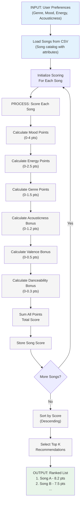

# Data Flow Diagram

```mermaid
graph TD
    A["INPUT: User Preferences<br/>(Genre, Mood, Energy, Acousticness)"] --> B["Load Songs from CSV<br/>(Song catalog with attributes)"]

    B --> C["Initialize Scoring<br/>For Each Song"]

    C --> D["PROCESS: Score Each Song"]
    D --> E["Calculate Mood Points<br/>(0-4 pts)"]
    E --> F["Calculate Energy Points<br/>(0-2.5 pts)"]
    F --> G["Calculate Genre Points<br/>(0-1.5 pts)"]
    G --> H["Calculate Acousticness Bonus<br/>(0-1.2 pts)"]
    H --> I["Calculate Valence Bonus<br/>(0-0.5 pts)"]
    I --> J["Calculate Danceability Bonus<br/>(0-0.3 pts)"]

    J --> K["Sum All Points<br/>Total Score"]
    K --> L["Store Song Score"]

    L --> M{"More Songs?"}
    M -->|Yes| C
    M -->|No| N["Sort by Score<br/>(Descending)"]

    N --> O["Select Top K<br/>Recommendations"]

    O --> P["OUTPUT: Ranked List<br/>1. Song A - 8.2 pts<br/>2. Song B - 7.5 pts<br/>..."]

    style A fill:#e3f2fd
    style B fill:#e3f2fd
    style D fill:#f5f5f5
    style E fill:#f5f5f5
    style F fill:#f5f5f5
    style G fill:#f5f5f5
    style H fill:#f5f5f5
    style I fill:#f5f5f5
    style J fill:#f5f5f5
    style K fill:#f5f5f5
    style L fill:#f5f5f5
    style N fill:#f5f5f5
    style O fill:#f5f5f5
    style P fill:#e8f5e9
```
